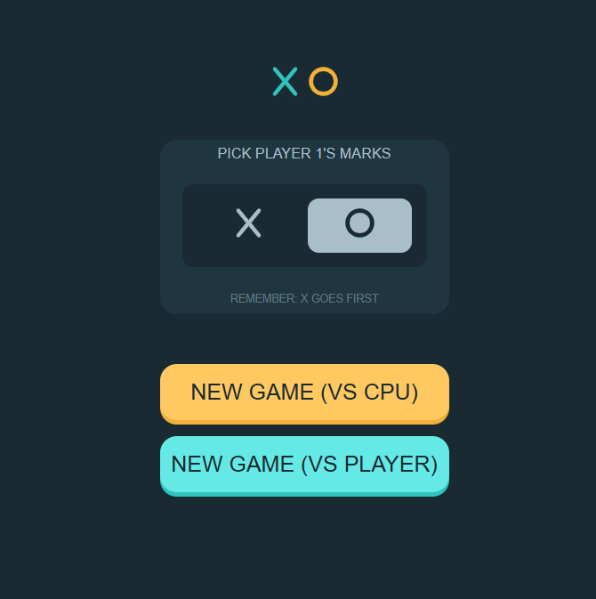
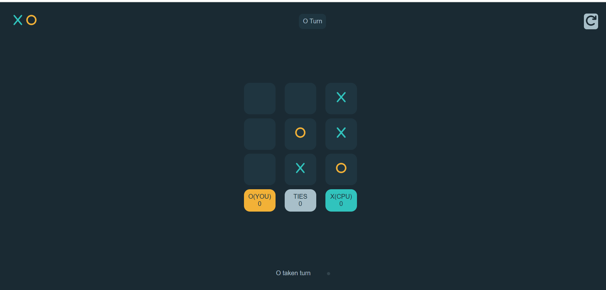
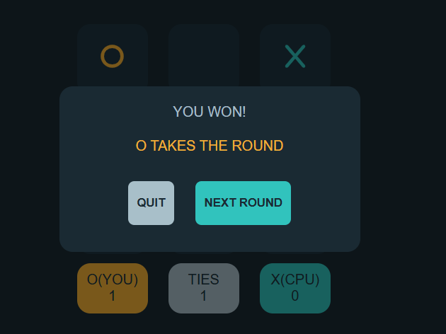

# 🎮 Tic Tac Toe Game

A fully functional **Tic Tac Toe game** built with **HTML, CSS, and JavaScript**.  
This project supports both **Player vs Player** and **Player vs CPU** modes, with score tracking and round-based gameplay.  

---

## 🚀 Features
- 🎲 **Two game modes**:
  - Player vs CPU  
  - Player vs Player  
- ⭕❌ Choose your symbol (**X** or **O**)  
- 🏆 Keeps track of **scores and ties** across rounds  
- 🔄 **Restart** or play the **next round** without reloading  
- 🎨 Clean, modern UI inspired by gaming dashboards  
- 📱 Responsive design  

---

## 🛠️ Tech Stack

- HTML5

- CSS3

- JavaScript (Vanilla JS)
  
  ---

## 🖼️ Screenshots

### 🔹 Choice Screen
Pick your mark and choose between CPU or Player mode.  


### 🔹 Gameplay
Play Tic Tac Toe with live score tracking.  


### 🔹 Result Popup
Winner/Draw announcement with **Next Round** option.  



---

## 🎮 How to Play
1. Open the game in your browser (`index.html`).  
2. Select **X** or **O** as your symbol.  
3. Choose **VS CPU** or **VS Player** mode.  
4. Take turns marking the cells until:
   - A player wins (3 in a row, column, or diagonal).  
   - The board fills (resulting in a draw).  
5. Click **Next Round** to continue or **Quit** to restart from the main menu.  

---

## ⚡ Installation
Clone the repository and open the game in your browser:  

```bash
git clone https://github.com/muhammad-husnain-ali-web/Tic-Tac-Toe.git

